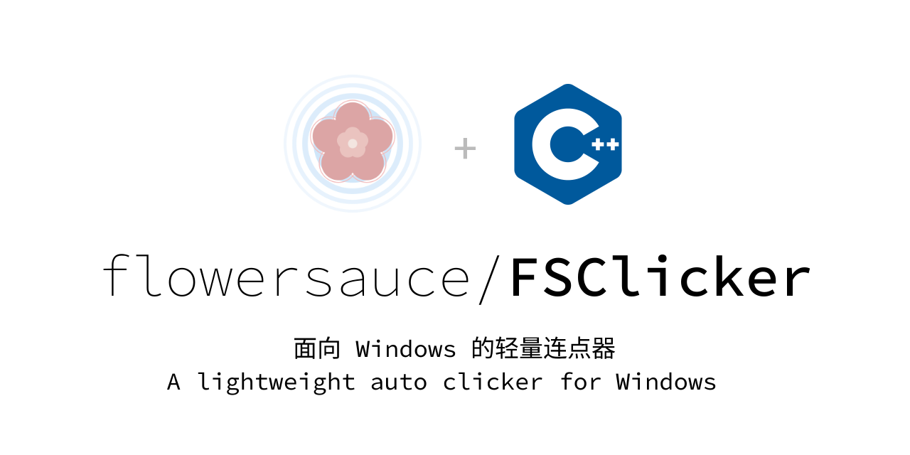

<p align="center">
  
  
  
  
  
</p>

<p align="center">
  中文 | <a href="README.en.md">English</a>
</p>

<p align="center">
  <a href="#功能">功能</a> ·
  <a href="#下载">下载</a> ·
  <a href="#构建">构建</a> ·
  <a href="#打包">打包</a> ·
  <a href="#许可">许可</a>
</p>

---

## 功能

- 鼠标及自定义按键输入。
- 连击与长按两种输入行为。
- 固定坐标点击，可在屏幕上直接捕获坐标。
- 周期输入，支持 `0% - 20%` 的动态误差。

## 下载

在 GitHub Release 下载最新的 Windows 发布包，解压后运行 `FSClicker.exe`。

## 构建

项目使用 Qt Quick 编写。

需要：

- Windows
- CMake 3.30+
- Qt 6.11+
- MinGW
- Python 3，用于发布打包

配置示例：

```powershell
cmake -S . -B build -G Ninja `
  -DCMAKE_PREFIX_PATH="$env:QT_ROOT"
```

构建：

```powershell
cmake --build build --target FSClicker
```

## 打包

先完成构建，再运行：

```powershell
python scripts/package_app.py
```

脚本会搜索名称包含 `build` 的构建目录，使用其中最新的 `FSClicker.exe`，并生成：

```text
output/release/FSClicker-v<version>-windows-x64-portable.zip
output/release/FSClicker-v<version>-windows-x64-portable.zip.sha256
```

便携包和本地开发运行会把配置文件保存到程序目录下的 `config/config.json`。Velopack 安装版会把配置保存到安装根目录下的 `config/config.json`，以便更新时保留、卸载时随安装目录移除。

默认发布包会包含必需的 MinGW/编译器运行时 DLL，不包含 Qt 翻译文件和软件 OpenGL 兜底库。需要 OpenGL 兼容性兜底时可以使用：

```powershell
python scripts/package_app.py --keep-opengl-sw
```

如需同时生成 Velopack 安装版，先安装 Velopack CLI，再运行：

```powershell
python scripts/package_app.py --with-velopack
```

同时会生成：

```text
output/release/FSClicker-v<version>-windows-x64-setup.exe
output/release/FSClicker-v<version>-windows-x64-setup.exe.sha256
```

不传参数直接运行脚本时，也可以按提示选择是否生成安装版。

最终可直接上传到 GitHub Release 的产物会统一输出到：

```text
output/release/
```

## 许可

Copyright © 2024 Flowersauce
